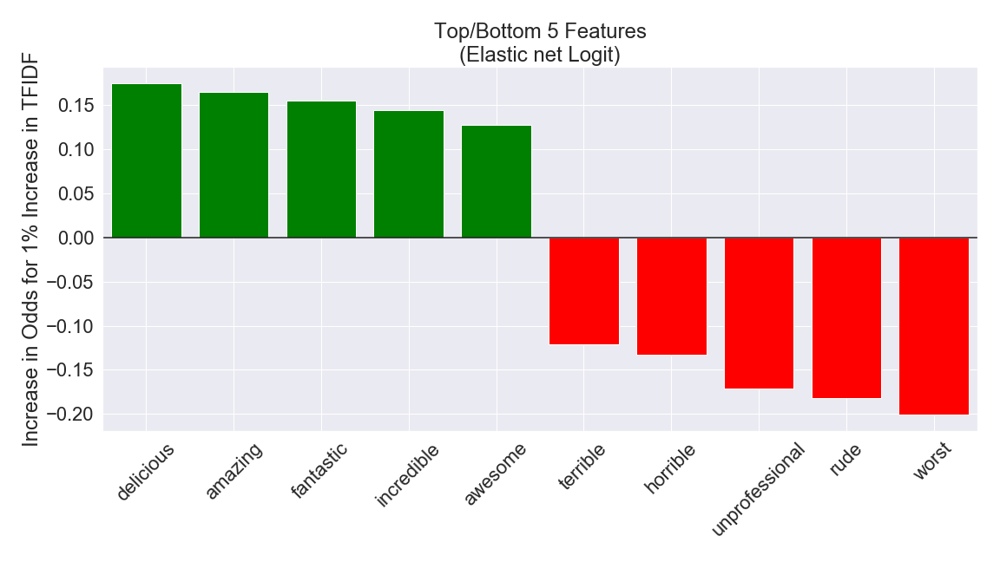
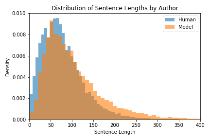
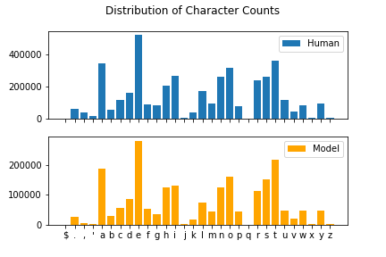
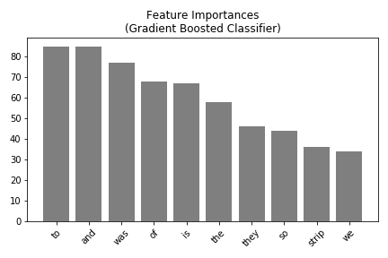

See my notebook "yelp-reviews-project.ipynb" for now.

# Automated Crowdturfing
**Generating Realistic Reviews**

## Andrew Kin-Yip Chien
[Linkedin](https://www.linkedin.com/in/andrew-k-chien/) | [Github](https://github.com/kchien3) | [Slides](https://github.com/kchien3/yelp-reviews-project/blob/master/presentation/yelp_reviews_project-slides.pdf)

## Table of Contents

* [Background and Motivation](#background-and-motivation)
* [Data](#data)
* [Feature Engineering](#feature-engineering)
* [Exploration](#exploration)
* [Revenue Maximization Strategies](#revenue-maximization-strategies)
* [Conclusions](#conclusions)
* [Future Directions](#future-directions)
* [References](#references)

## Background and Motivation
[82%](www.brightlocal.com/research/local-consumer-review-survey) of consumers read online reviews for local businesses.  
<br>
[76%](www.brightlocal.com/research/local-consumer-review-survey) of consumers trust online reviews as much as recommendations from family and friends.  
<br>
A one-star increase in yelp rating leads to a [5-9%](https://www.hbs.edu/faculty/Pages/item.aspx?num=41233) increase in revenue.  
<br>
Having good online reviews is vital for business success. Because it can be difficult to implement organizational changes that lead to good reviews, like investing in decor, training and the product (eg. food), an easier route to good reviews is 'crowdturfing,' or hiring people to write good reviews for services they never received. This project explores automated crowdturfing -- training a neural network to generate positive reviews for businesses, as well as methods to detect generated reviews.

## Data
### Description
Yelp provides [over 15 million user reviews](https://www.yelp.com/dataset) on their website for anybody to explore. In this project, various subsets of reviews are used for different investigations, with the size of subsets varying due to computational considerations.

The highlight of this project is a text generator model, and the training set for that model consisted of 2.7 million characters drawn from 5-star yelp reviews.

A neural network model was used to generate a corpus of review text consisting of approximately 2.8 million characters (500,000 words) and was used as part of the training set for building classifiers

## Exploration
An elastic net logistic classifier was trained on only 1-star (negative) and 5-star (positive) reviews to identify words most indicative of positive and negative ratings.
<div align='center'>

</div>
Knowing a bit about the anatomy of a five-star review gives us a goal for generating those reviews.

## Text Generation
Using Tensorflow's python API, character-level text generation models were built in this project instead of word-level models. The data required to train character-level models requires less pre-processing and character-level models contain fewer parameters to train, only having input and output layer sizes equal to the number of unique characters in the corpus rather than the number of unique words in the corpus (which is much larger.)  

### Recurrent Neural Networks
At a high level, recurrent neural networks are a type of neural network suited to handling data with relationships across sequences. In the context of text data, RNNs receive sequences of text, here parsed as characters, and are trained to predict the next character in the sequence. Concretely, as the model is trained, it learns to spell words, then arrange those words in grammatical sequences, then create sensible sentences, then stay on topic as it is generating text. That was the ultimate goal of the text generation portion of this project, with different RNN architectures making different degrees of progress toward that goal.  

Each model was trained overnight taking 8-12 hours to complete 15-30 epochs. The portion of the model that generates text has a 'temperature' parameter that affects the probability distribution of the next predicted character. A high temperature drives the distribution towards a uniform, resulting in random sequences of characters. A low temperature exaggerates the distribution, resulting in very repetitive sequences as the model becomes limited in its selection of the next generated character.

#### Simple GRU RNN
GRU cells are a simplified variant of LSTM that can model long term sequence dependencies with faster training speeds. This simple GRU model contains an input layer that accepts 100 character length sequences, an embedding layer that creates 256 features from the input layer, 1 recurrent layer with 1024 nodes, and an output layer with nodes corresponding to unique characters in the training corpus. The Tensorflow model architecture is reproduced below:
```
Model: "sequential"
_________________________________________________________________
Layer (type)                 Output Shape              Param #   
=================================================================
embedding (Embedding)        (64, None, 256)           37120     
_________________________________________________________________
gru (GRU)                    (64, None, 1024)          3938304   
_________________________________________________________________
dense (Dense)                (64, None, 145)           148625    
=================================================================
Total params: 4,124,049
Trainable params: 4,124,049
Non-trainable params: 0
_________________________________________________________________
```
This model took 8 hours to train 30 epochs, but training loss increased after the 15th epoch (validation loss is unavailable.) Ultimately, weights from epoch 15 and a temperature of 0.65 were chosen for text generation.  

Here is a 1400 character sequence generated by this model:
```
What they treat it was a good thing. Wow this is the place. It is always something that I haven't been in the large and major place. Through the exhibits to choose from an honest menu. 

When I was heading on a weekly accident for anything to do what this will definitely stay in Vegas. I saw a beer and I have a second opinion for a new car in the counter. Our group of tucked is incredibly tender and incredibly electronic in the San Francisco roll was the duct wall from the match.
What a cozy check and a house salad.  My favorites but I both surprised that this place deserves Brooklynt. The owners is the best I have made an appointment to take pictures and the food was wonderful.

The staff greeted us and the service is two acts for beer is a great way to start at the same time. 

With the Montreal starts for the sugar and thin cuirity is so diving!  
Everything was clean and prepared.  I was here twice in the area and had a big meal this is mall of course. It is impeccably the main stop in the store and the company later they do it, right?  Thanks Mi,way I am a couple of years now, but I was a bit busy when I was in Phoenix at the pool now this was incredibly calm but not the best part of what every time I've been to the bar area and the staff is so beautiful.  But the coconut frame de green tea was displays about 10 minutes. The chocolate mousself does this include winnings, i
```

#### Deep GRU with Droput RNN
GRU cells are a simplified variant of LSTM that can model long term sequence dependencies with faster training speeds. This RNN is 'deep' because it contains three hidden layers. The deep GRU with droput model contains an input layer that accepts 100 character length sequences, an embedding layer that creates 256 features from the input layer, 2 recurrent layers with 512 nodes each and node dropout after each layer as a form of regularization, and an output layer with nodes corresponding to unique characters in the training corpus.  
Memory constraints limited the size of the recurrent layers to 512 nodes each rather than 1024.  

The Tensorflow model architecture is reproduced below:
```
Model: "sequential_2"
_________________________________________________________________
Layer (type)                 Output Shape              Param #   
=================================================================
embedding_2 (Embedding)      (32, None, 256)           37120     
_________________________________________________________________
gru_2 (GRU)                  (32, None, 512)           1182720   
_________________________________________________________________
gru_3 (GRU)                  (32, None, 512)           1575936   
_________________________________________________________________
dense_2 (Dense)              (32, None, 145)           74385     
=================================================================
Total params: 2,870,161
Trainable params: 2,870,161
Non-trainable params: 0
_________________________________________________________________
```
This model took 10 hours to train 30 epochs, but training loss increased after the 15th epoch (validation loss is unavailable.) Ultimately, weights from epoch 15 and a temperature of 0.7 were chosen for text generation.  

Here is a 1400 character sequence generated by this model:
```
He was a beautiful city and spicy and the owner which is heady and enjoyed in the sweet treat of bacon tuna and the products dinner and did not turn and not just don't know the rest of the spring sauce and strange of customers are not to come. The staff was very contacted I was really well with the mom.  We are smoking and soft and accommodating, and delicious. The gentleman is pretty lucky and knowledgeable and flavorful and friendly and good and great. 

I always beat the best and really good food.

Also the booze will definitely admit I am a friend where we were sincerthe shopped out of the entrance of the bud they are all the project as they also have the places on desert selling a short down and the bread here is stuffed with the coffee on the cashier and check in peanut and tender and great buttery change. He always decided on the party as much so I was pretty cool and completely much as it comes with the pork company and had the service reviews and potatoes and they really can see an early thing with local groups. 

Thanks to the same time. 

The difference that the bar seasoned with the restaurants completely able to hip the whole prices. The chicken is a regular sauce of shooters and spices and bacon.  When I should be a regular fall over the customer service definitely there are very clean and salad; the texture of the lamb Gout Groupon and passpoon in a couple of ar
```

#### Deep LSTM with Dropout RNN
The performance of LSTM cells versus GRU cells was examined in this model. The RNN is 'deep' because it contains more than three hidden layers. The deep LSTM with dropout model contains an input layer that accepts 256 character length sequences, an embedding layer that creates 256 features from the input layer, 3 recurrent layers with 512 nodes each and node dropout after each layer as a form of regularization, and an output layer with nodes corresponding to unique characters in the training corpus.  

I also experimented with <SOR> (start of review) and <EOR> (end of review) tags so the model is able to indicate the start of a review and end of a review within a long sequence of generated text.

The Tensorflow model architecture is reproduced below:
```
Model: "sequential"
_________________________________________________________________
Layer (type)                 Output Shape              Param #   
=================================================================
embedding (Embedding)        (32, None, 256)           39168     
_________________________________________________________________
lstm (LSTM)                  (32, None, 512)           1574912   
_________________________________________________________________
lstm_1 (LSTM)                (32, None, 512)           2099200   
_________________________________________________________________
lstm_2 (LSTM)                (32, None, 512)           2099200   
_________________________________________________________________
dense (Dense)                (32, None, 153)           78489     
=================================================================
Total params: 5,890,969
Trainable params: 5,890,969
Non-trainable params: 0
_________________________________________________________________
```
This model took 12 hours to train 15 epochs, and validation loss was still decreasing when training was stopped. Weights from epoch 15 and a temperature of 0.75 were chosen for text generation.

Here is a review generated by this model:
```
<SOR>
They do not be said that the restaurant is really good and we saw a lot of dessert.  The parking local cocktail was as so much beautiful, you charge your life, and they do the Chocolate Honey's way.  I love the view of the bad looking forward by the staff as well as the side of each other restaurant.  I am so good. One car was extremely center paying it wyer in 201.  The past to carry for a variety of sauce.  They sell the walk in a window, but make the both director facility; but it was a little concert. 

When you enter, it is a good room at the bar, and soft price is not to be. They serve the front menu the most sort of Markshird is very highly. I'm in the Manlo's Cake, but I was able there were not relaxing for the one for their busy tones. Landscaping training the way.  The spice was time as I'm glad they are slightly busy down the food continual couple of the flavors are the best American but the service are not only dined.

Food
Great favorite is a crazy latte was delicious. I am stock inside the bar work looked about the place on my browns.<EOR>
```

#### Model Comparison
The simple GRU model produced the most coherent text by my judgement. The simple GRU model also achieved the lowest loss within the allotted training time. My proposed explanation for this observation is that the goal of the text generation model is to mimic human writing, therefore a model that overfits better achieves this goal than a model that is regularized.  

2.7 million characters of text (about 500,000 words) were generated by the simple GRU model over 8 hours and used as part of the training set for building text classifiers.

## Text Classification
Various model algorithms were explored to create classifiers to determine review authorship.

### Data Exploration
Some characteristics of machine authored and human authored reviews were analyzed and are presented here.  

<div align='center'>

</div>
The distributions of sentence lengths within human and machine authored reviews are similar but there is a clear visual difference to the eye. This may be a weakness of the model that text classifiers can exploit.  

<br><br>
<div align='center'>

</div>
The distribution of character counts within human and machine authored reviews look nearly identical to the eye, but there is a slight difference attributable to the temperature setting used in the text generating model. This detectable difference may be a weakness of the model that text classifiers can exploit.

### Model Comparison

| Model     | Tokens | Accuracy |
|-----------|--------|:--------:|
| LightGBM  | char   |    0.770 |
| LightGBM  | word   |    0.844 |
| Swivel NN | word   |    0.997 |

Classifiers using the LightGBM implementation of gradient boosting were trained on a data set consisting of positive human authored reviews and machine authored reviews. 

### LightGBM Gradient-Boosting (character tokens)
A classifier trained on character tokens achieved 77% accuracy in determining review authorship. 

### LightGBM Gradient-Boosting (word tokens)
A classifier trained on word tokens achieved 84.4% accuracy in determining review authorship. 
<div align='center'>

</div>
An examination of the feature importances from this classifier reveal that the text generation model differs from humans in its usage of conjunctions, and I also observed that it wrote the word 'strip' a lot. The text generator writes 'strip' a lot because the training corpus of reviews contained a lot of Las Vegas businesses, and 'strip' here is a reference to the Las Vegas Strip.

### Multilayer Perceptron with pre-trained embeddings
A feed-forward artificial neural network with fully connected layers (aka multilayer perceptron) was built with a pre-trained word embedding layer. Word embeddings convert words into numeric vectors such that words that are 'similar' have similar coordinates, and mathetical operations on words produce some intuitive results (e.g. King - Man + Woman = Queen.) The specific embedding algorithm used here is Swivel, which calculates word similarity based on the co-occurence of words (how often pairs of words appear together) and uses sharding to break up the massive matrices used for computation into smaller sub-matrices that are easier for computers to manipulate. Neural networks require a lot of data and time to train. Using pre-trained embeddings allows us to avoid reproducing the computational work done by Google (which would not be feasible given the time and resource limitations of this author.)  

The Tensorflow model architecture is reproduced below:
Model: "sequential_3"
_________________________________________________________________
Layer (type)                 Output Shape              Param #   
=================================================================
keras_layer_4 (KerasLayer)   (None, 20)                389380    
_________________________________________________________________
dense_6 (Dense)              (None, 16)                336       
_________________________________________________________________
dense_7 (Dense)              (None, 1)                 17        
=================================================================
Total params: 389,733
Trainable params: 389,733
Non-trainable params: 0
_________________________________________________________________

The 'KerasLayer' is the pre-trained embedding layer that transforms words into a 20-dimensional numeric vector. A further 16 node dense layer is added after the embedding layer to allow non-linear features to be generated from words that may be useful for the classification task, which is performed by the 1 node output layer.  
This neural network classifier achieves 99.7% accuracy in determining review authorship.

## Conclusions
This project was concluded at this point, with the result being that the text generator model performed poorly at fooling various text classifiers. I would like to highlight that it is very impressive that the text generator has learned to spell words correctly, use punctuation and capitalization, and produce grammatical (if nonsensical) sentences, given the small training corpus (2.7 million characters consisting of 5-star yelp reviews.)

I provide here some more generated reviews for the reader's amusement (the seed sequence gets the model 'on topic' though this text generation model has not gained the ability to stay on topic):  

The author's fictional Italian restaurant:
```
Seed sequence: Kin-Yip's Italian is amazing!

 -- good prices... which is a big fan of sushi rice, which turned out to be a pretty place for the day. I thought it would have to say I enjoy the hostess that do not come back again and show good friends and for a friend who wants to be a party of How Clean food management… I would say I have seated at a bar scanned...
When you can say possibly the same for the same time with a bar area, as well as the meat is amazing!  So many people try to sell in the restaurant. I enjoyed the chicken, several milkettes will discover a pastry bath loan options (so you can easily find the sliders and honestly, they don't have a blood ball sodas for everyone.
```
For the purposes of crowdturfing, this review highlights areas of excellence:  
'good prices'  
'the meat is amazing'  
'enjoyed the chicken'  
as well as areas for improvement:  
'they don't have a blood ball sodas for everyone'

The author's colleague operates a cafe:
```
Seed sequence: The Americano at Chul's was amazing!

I of course I would say that it is a half mix and got a free meal and helpful. The waitress was a giant chocolate and salmon menu. They are fantastic and friendly and helpful.  The musical was the perfect temperature to what you pay for it.  You can advertise in the past trying to get a drink.
```
For the purposes of crowdturfing, this review highlights unique aspects of the cafe:  
'The waitress was a giant chocolate and salmon menu'  

as well as areas of excellence:
'They are fantastic and friendly and helpful'

## Future Directions

## References
* Murphy, Rosie. “Local Consumer Review Survey: Online Reviews Statistics & Trends.” BrightLocal, 28 Jan. 2020, www.brightlocal.com/research/local-consumer-review-survey.
* Luca, Michael. "[Reviews, Reputation, and Revenue: The Case of Yelp.com](https://www.hbs.edu/faculty/Pages/item.aspx?num=41233)." Harvard Business School Working Paper, No. 12-016, September 2011. (Revised March 2016. Revise and resubmit at the American Economic Journal - Applied Economics.)
